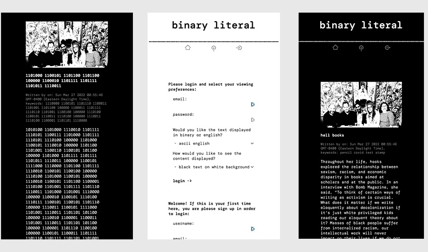

# binaryLiteral 1.0
  

  

  ## OVERVIEW:
   technology and culture blog. This is an interactive website to showcase the events in my community in a style that has more flavor than generic social media. Social media doesn't have the personality inherent to, say, counter culture 'zines that i grew up with. This is an attempt to bring some of that 'zine flavor to a digital forum.

  ## Table Of Contents:
  [Installation](README.md#installation) 
  [Usage](README.md#usage) 
  [Tests](README.md#tests) 
  [Credits](README.md#credits) 
  [Questions](README.md#questions) 
  [License](README.md#license) 

  ## Installation
  On logging in, you have the option to view the entire site in black on white, white on black, binary, or english. You are then able to contribute your own content and participate in the conversation.

  ## Usage
  The website should user-intuitive.

  ## Tests
  Insomnia was used for testing in the creation of this site. 

  ## Credits
  This is a collaborative site intended to incorporate a broad group of friends. In addition the coders that created Sequelize, Express, MySql2, dotenv, Handlebars, Express-Session, Bcrypt and all of the associated dependencies should be considered contributors.

  ## Questions
  [Becket, Codeclast](becketbowes@gmail.com)
  [Github Page](http://www.github.com/becketbowes)

  ## License
  [Creative Commons Attribution License, Sun Mar 27 2022 01:29:04 GMT-0400 (Eastern Daylight Time)](https://creativecommons.org/licenses/by/4.0/legalcode)
